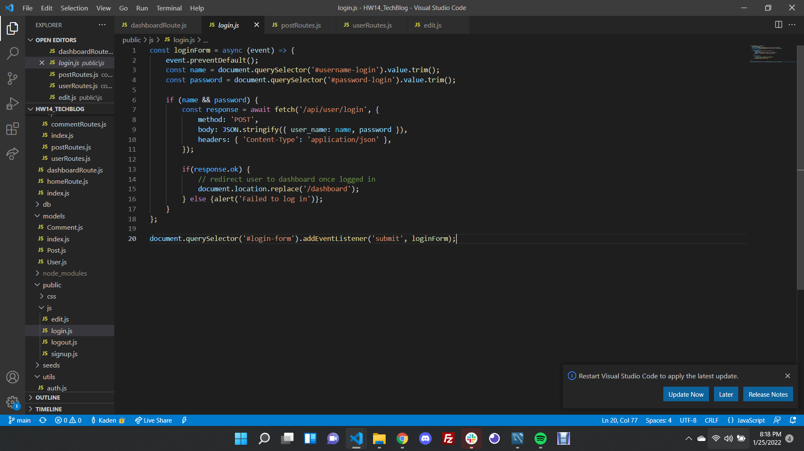

# HW14_TechBlog
---
(https://opensource.org/licenses/MIT)
## INSTRUCTIONS
This project is designed to allow the user to create and account and post, delete, or update blog posts when signed in to the application.
## Table of Contents
*[Installation:] (#installation)
*[Usage:] (#usage)
*[License:](license)
*[Contribution:] (#contributing)
*[Testing:] (#tests)
*[Questions?](#questions)

## Installation
To install this app so that it functions properly, clone my github repository, open the integrated terminal tied to the current project folder, then run 'npm install' in your terminal. This should download all necessary packages.

## Usage
You can use this project to allow users to create an account so that on top of viewing the posts on the blog site, a signed in user can also create new posts, delete posts and update posts via the dashboard.

## Example
Here you can see some key elements within the code, that ensures that these objects are possible to create, that the path is being directed to the right location and how the these different data tables relate to one another:

 # License
            This project is license under the MIT license
            

## Contributing
Users can contribute to this project by playing with the code given and identifying more elaborate features that can be added to this program! Such as polished aesthetic features, more routes for more elaborate features such as a folder to tab certain blog posts you want to save to come back to later etc.

## Tests
This project can be tested by installing the necessary packages then run the program on your local environment which can be done via your intergrated terminal or tools alike such as gitbash or windows powershell.

You can find find the deployed application via: (https://kadens-tech-blog.herokuapp.com/)

## Questions

    If you have any questions regarding the repository published, please feel free to reach out to me at kadenkelsey33@gmail.com,
    if you would like to look at the code that made this application, you can find this under my repos in GitHub. My GitHub
    username is K-Kelsey
    
